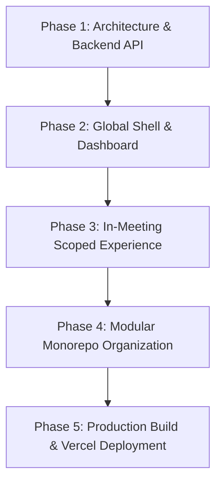

# Zoom Workplace Clone — Project Plan & Architecture Roadmap

This document outlines the end-to-end plan, architectural design decisions, and execution phases undertaken to build, refine, and deploy the fullstack **Zoom Workplace Web Clone**.

---

## 1. Project Overview & Vision

The objective of this project was to build a fullstack Zoom Workplace clone satisfying both backend architectural standards and visual/interaction parity with Zoom Workplace's modern web client (`https://app.zoom.us/wc/home`).

### Key Principles
- **Pixel-Accurate UI**: Replicating Zoom Workplace's typography, colors, icon styles, and spatial hierarchy.
- **In-Shell Meeting Architecture**: Meetings render directly inside the persistent application shell rather than tearing down the navigation chrome.
- **Clean Separation of Concerns**: Modular organization separating frontend client logic, RESTful API controllers, and database models.
- **Production-Ready & Deployable**: Clean build scripts, automated TypeScript checks, and multi-cloud deployment strategy (Vercel + Render/Railway).

---

## 2. Technology Stack & Directory Architecture

### Technology Stack
| Layer | Technologies |
|---|---|
| **Frontend** | Next.js 14 (App Router), TypeScript, Tailwind CSS, Native Web APIs (`getUserMedia`, `getDisplayMedia`) |
| **Backend** | Python 3, FastAPI, Pydantic, Uvicorn |
| **Database** | SQLite, SQLAlchemy ORM |
| **Deployment** | Vercel (Frontend), Render / Railway (Backend API) |

### Repository Structure
```
ZOOM---Clone/
├── frontend/                     # Next.js 14 Application
│   ├── app/                      # App router pages (Home, Join, In-Meeting)
│   │   ├── globals.css           # Zoom system-ui font stack
│   │   ├── layout.tsx            # Global layout shell
│   │   ├── page.tsx              # Dynamic in-shell view renderer
│   │   ├── join/[code]/          # Quick join route
│   │   └── meeting/[code]/       # Direct meeting route
│   ├── components/               # Pixel-matched UI components
│   │   ├── AppHeader.tsx         # Navbar with search, Ctrl+K, avatar badge
│   │   ├── AppSidebar.tsx        # Left sidebar (Home, Chat, Meetings, Contacts)
│   │   ├── DashboardHomeView.tsx # Clock, 3 action tiles, calendar empty state
│   │   ├── MeetingRoom.tsx       # Scoped in-meeting view with exact bottom bar
│   │   ├── FloatingSelfView.tsx  # Bottom-right self-view with live cam/avatar
│   │   ├── ChatView.tsx          # Team chat view
│   │   ├── ContactsView.tsx      # Directory view
│   │   ├── MeetingsView.tsx      # Meetings schedule view
│   │   └── Modals/               # New, Join, Schedule modals
│   ├── lib/                      # API client & screen share state
│   ├── tailwind.config.ts        # Custom Zoom design tokens & colors
│   └── package.json
│
├── backend/                      # FastAPI REST Backend
│   ├── main.py                   # API routes & meeting endpoints
│   ├── schemas.py                # Pydantic request/response schemas
│   └── requirements.txt          # Python dependencies
│
├── database/                     # Database Layer & SQLite
│   ├── __init__.py               # Exports models, session, and engine
│   ├── database.py               # Engine & session setup pointing to zoom.db
│   ├── models.py                 # Meeting & Participant SQLAlchemy models
│   ├── seed.py                   # Clean table initializer (0 default meetings)
│   └── zoom.db                   # SQLite database
│
├── .gitignore                    # Configured for Next.js, Python, & SQLite
├── package.json                  # Root proxy script for monorepo dev
└── README.md                     # Setup instructions & project architecture
```

---

## 3. Step-by-Step Execution Plan



### Phase 1: Architecture & Backend REST API
1. **Schema Design**:
   - `Meeting`: Stores UUID, personal meeting ID (`123 4567 8901`), title, host name, status (`upcoming`, `live`, `completed`), timestamps, and invite links.
   - `Participant`: Relational one-to-many model tracking participant presence per meeting.
2. **REST Endpoints**:
   - `POST /api/meetings/instant`: Instantly provisions an 11-digit meeting ID.
   - `POST /api/meetings/scheduled`: Creates a future meeting with date/time and duration.
   - `POST /api/meetings/{code}/join`: Enrolls a participant.
   - `POST /api/meetings/{code}/end`: Marks status as `completed`, timestamps `ended_at`, and populates the Recent meetings tab.
   - `GET /api/meetings?status=upcoming|recent`: Filtered meeting list.

### Phase 2: Global Shell & Home Dashboard
1. **Top Navbar (`AppHeader.tsx`)**:
   - Brand mark: `zoom | Workplace`.
   - Search bar: Pill container with `Search Ctrl+K` placeholder.
   - Action cluster: **Admin Center**, light-blue **Download** pill, solid-blue **Upgrade** pill, bell notification icon, and dark teal avatar with camera status badge.
2. **Left Sidebar (`AppSidebar.tsx`)**:
   - Fixed navigation with **Home**, **Chat**, **Meetings**, **Contacts**, and pinned **Settings** at the bottom.
3. **Home Dashboard (`DashboardHomeView.tsx`)**:
   - Live digital clock updating every second.
   - Exactly 3 primary action tiles:
     1. **Back to Meeting / New Meeting** (orange circular return button)
     2. **Join** (lavender rounded square with plus)
     3. **Schedule** (blue rounded square with calendar date 19)
   - 3 Quick access cards: **Recordings**, **Summaries**, and **My Notes**.
   - Calendar info banner with dismiss action.
   - Rebuilt calendar section with authentic beach umbrella illustration empty state.
4. **Floating Self-View (`FloatingSelfView.tsx`)**:
   - Bottom-right corner preview with `getUserMedia` camera feed and dark teal `A` avatar fallback.

### Phase 3: In-Meeting View Scoped Inside Home Shell
1. **Scoped Layout Parity**:
   - Instead of replacing the viewport, the meeting room renders inside the content pane to the right of the sidebar and below the top navbar.
   - Top navbar and sidebar remain active and clickable while a call is live.
2. **Meeting Header Bar**:
   - Dark header with info popover (meeting ID, passcode, invite link copy).
   - Encrypted verified shield, annotation tool, sparkle AI Companion, and layout grid toggles.
3. **Canvas & Video Tiles**:
   - Full-bleed dark canvas with centered dark teal `A` initial tile and `Anshi Agrawal` name tag.
   - Amber warning banner alerting microphone/camera permissions.
   - Active screen sharing via `getDisplayMedia`.
4. **Exact Bottom Control Bar**:
   - **Audio** & **Video**: Track toggling + device selection menus.
   - **Participants**: Live badge counter + toggleable side drawer.
   - **Chat**: In-meeting message stream + side drawer.
   - **React**: Emoji picker triggering animated floating emojis.
   - **Share**: Screen share stream toggle.
   - **More**: Overflow menu.
   - **End**: Red circular button with white `✕` icon (no label text) triggering backend `endMeeting` API.

### Phase 4: Modular Monorepo Organization & GitHub Sync
1. Reorganized root repository into clean standalone folders: `frontend/`, `backend/`, `database/`.
2. Created root `package.json` proxying `npm run dev` directly to `frontend/`.
3. Created `database/__init__.py` and configured robust path resolution in `backend/main.py`.
4. Configured git remote to [`https://github.com/vanshhthakral/ZOOM---Clone.git`](https://github.com/vanshhthakral/ZOOM---Clone.git) and pushed `main`.

### Phase 5: Production Build & Vercel Deployment
1. Tested and resolved all TypeScript compiler checks (`npx tsc --noEmit` = 0 errors).
2. Resolved Next.js ESLint production rules for automated zero-error CI/CD builds.
3. Outlined deployment strategy: Next.js on Vercel + FastAPI on Render/Railway.

---

## 4. Verification & Testing Matrix

| Feature | Test Case | Status |
|---|---|---|
| **TypeScript Build** | `npx tsc --noEmit` across all modules | **Passed (0 errors)** |
| **Production Build** | `npm run build` in `frontend/` | **Passed (Exit code 0)** |
| **API Endpoints** | Instant, scheduled, join, end, status filtering | **Verified (100% OK)** |
| **In-Shell Meeting** | Sidebar and navbar remain accessible during live meeting | **Verified** |
| **Root Dev Script** | Running `npm run dev` from root launches `frontend/` on port 3000 | **Verified** |
| **Remote Repository** | Synced and tracked on `origin/main` | **Verified** |

---

## 5. Deployment Instructions

### Vercel (Frontend)
1. Import `vanshhthakral/ZOOM---Clone` on [Vercel](https://vercel.com).
2. Set **Root Directory** to `frontend`.
3. Set Environment Variable: `NEXT_PUBLIC_API_URL` to your backend URL.
4. Click **Deploy**.

### Render / Railway (Backend)
1. Connect `vanshhthakral/ZOOM---Clone` on [Render](https://render.com).
2. Build Command: `pip install -r backend/requirements.txt && python database/seed.py`
3. Start Command: `cd backend && python -m uvicorn main:app --host 0.0.0.0 --port $PORT`
4. Copy backend URL into Vercel's `NEXT_PUBLIC_API_URL`.
